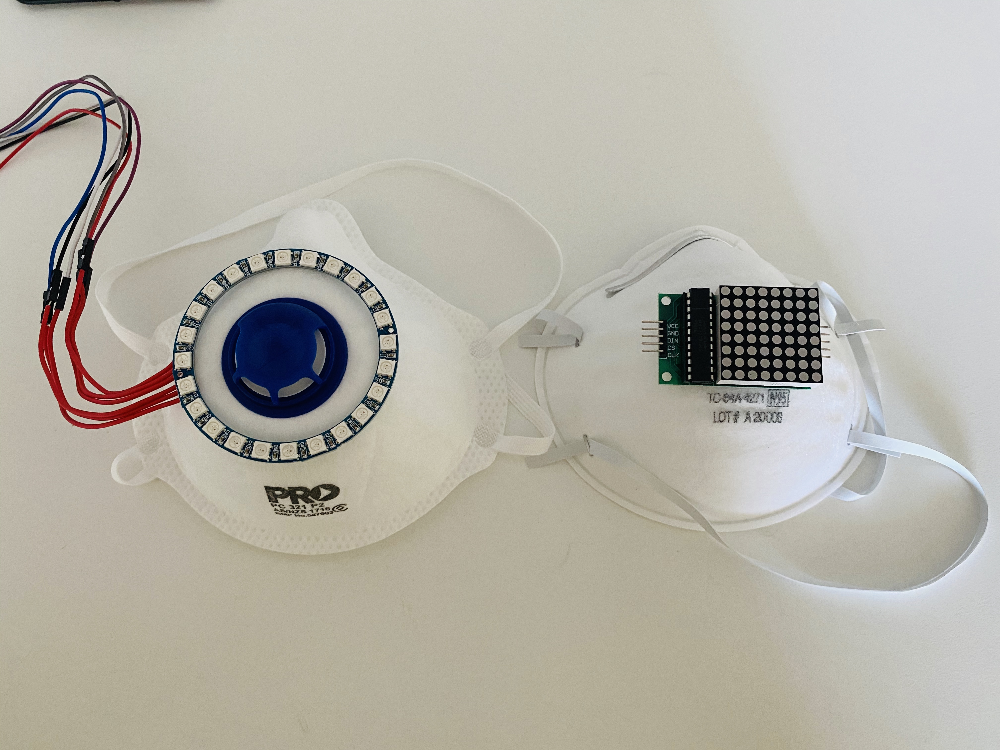
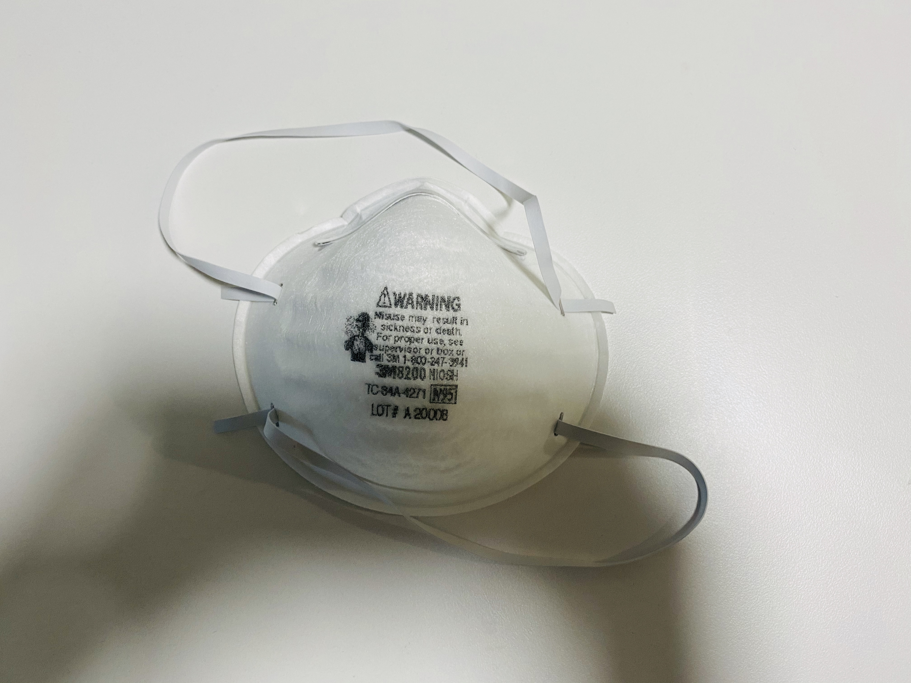
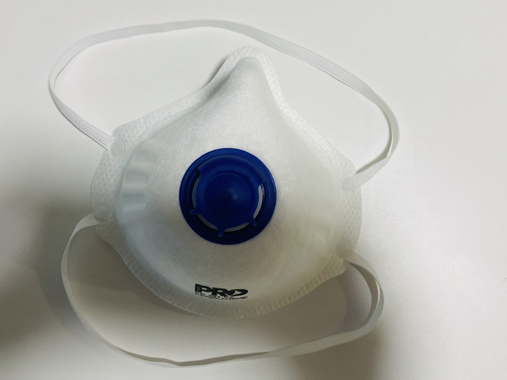
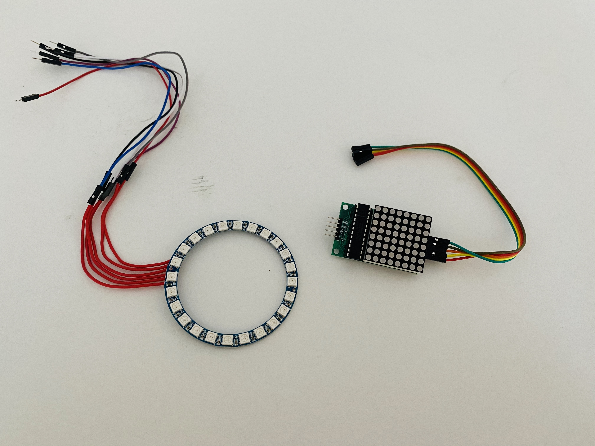
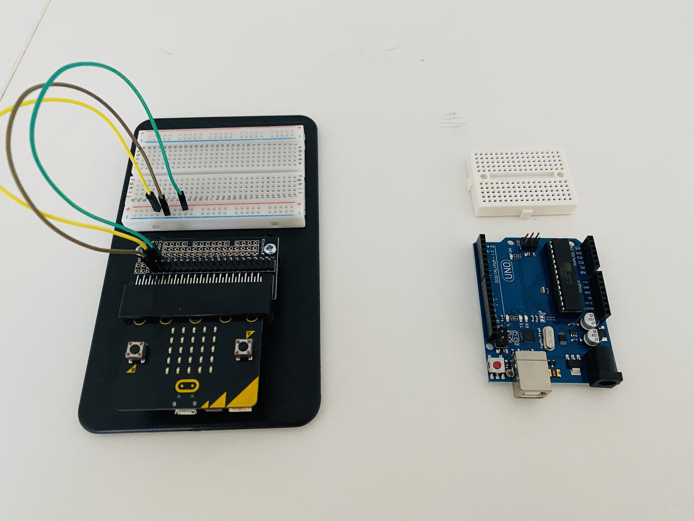
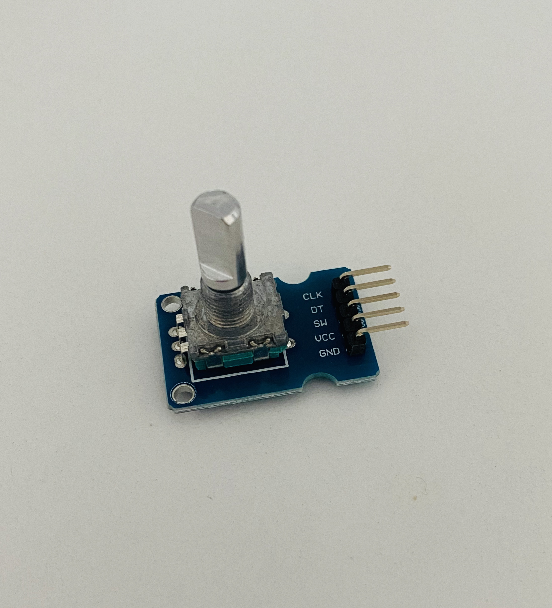
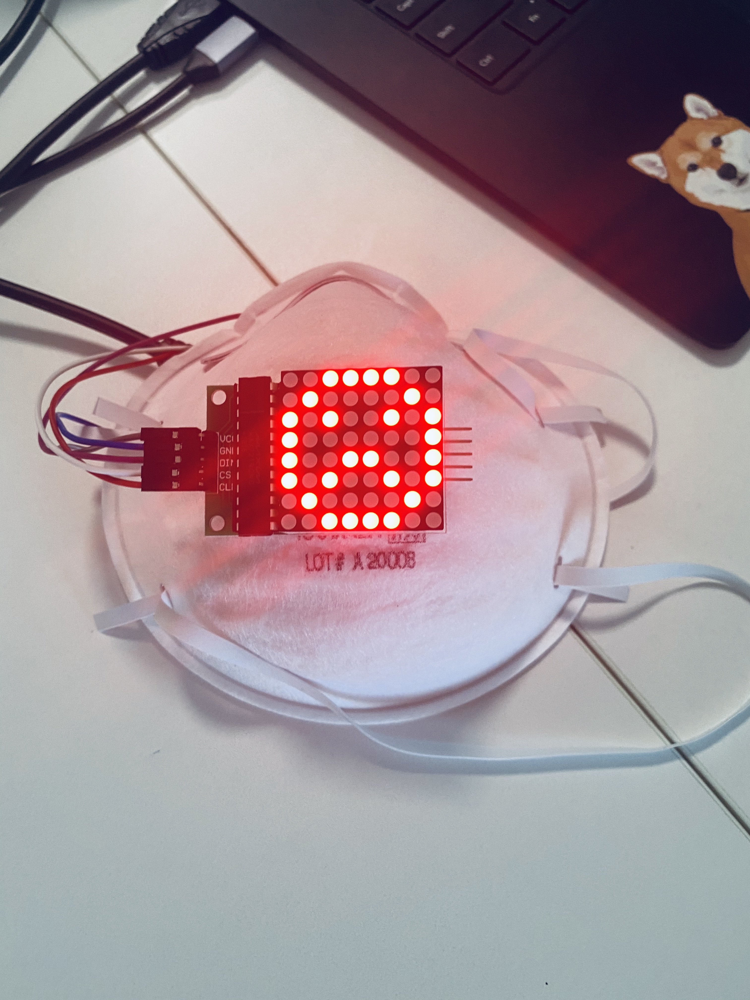

# *Emotional mask*
## *Yixuan Zheng(Carr)* ##
## 7515QCA Making Interaction 2020 Final Project ##

In the assessment 2 section, I come up with four ideas. The facial expression mask item was selected as the target of assessment3.

This project is about a mask that expresses emotion. It's done by a light that's mounted on the mask.

In the first half of 2020, due to the impact of the epidemic, people have put on masks and prevented the threat of disease for their own health and safety. But at the same time people lose something very important in the process of communication, and that is the expression. This emotional mask is designed for people to communicate with each other in an epidemic situation. Hopefully, it'll add a little bit of fun to their conversation.

Show expressions and emotions by changing the color or shape of the light. It's like the emoji people add to their text messages. To make the conversation more interesting.

### Materials ###

The N95 mask was chosen for the material preparation, on the grounds that it has a better formability than a normal medical mask.

### Device ###

Have a lot of different things on the device, and hopefully try as many different methods as possible to achieve the desired effect.

In addition to trying out micro bit, this time I learn to use DUINOTECH'S UNO r3 board.

In the light control convenience also try to use the rotating button to control.

As a novice to programs and devices, try to use. But Not really.

### Code ###
First Time learning and trying to write code with Arduino

### Production Record ###

### Video Link ###

https://youtu.be/-iNegEs__PQ

